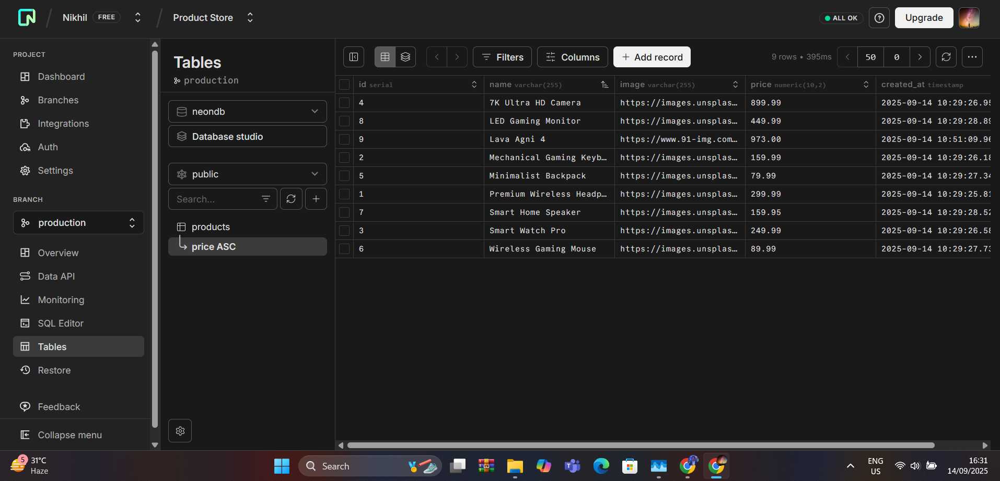
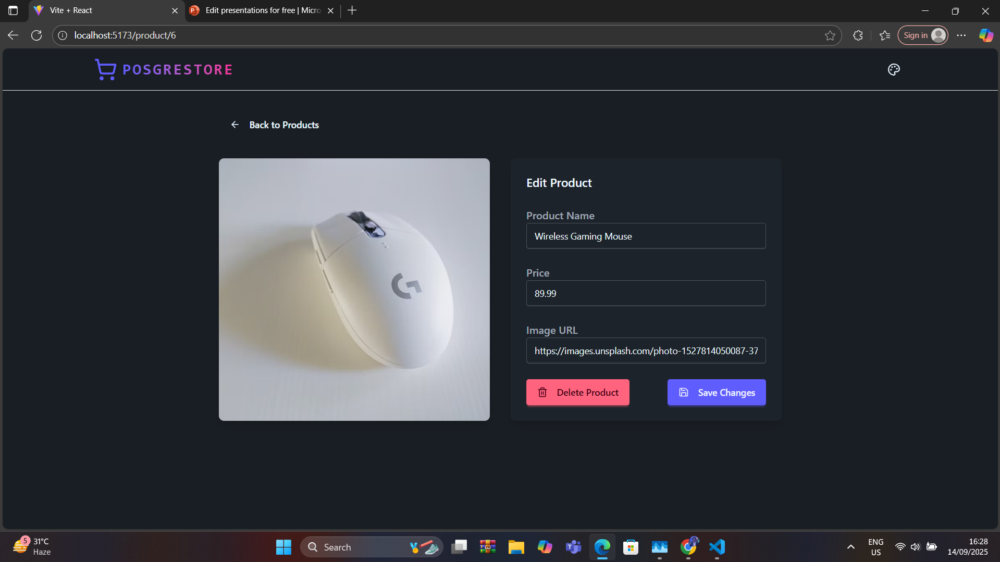
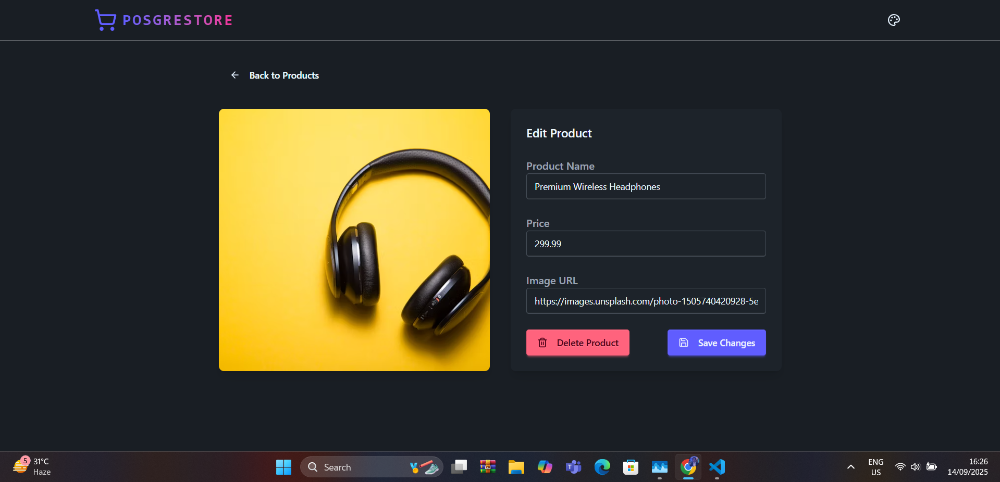
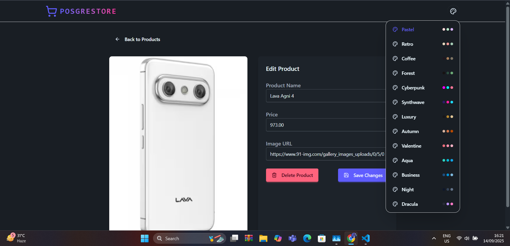
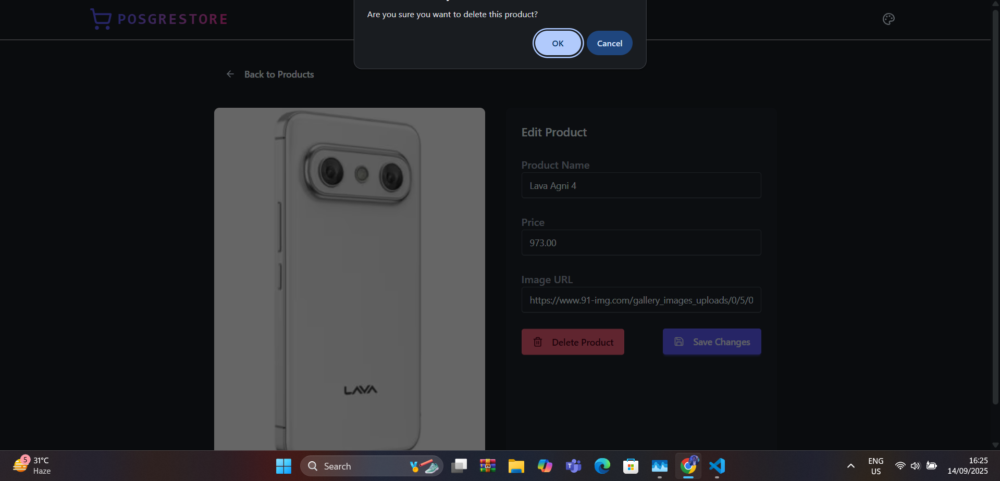
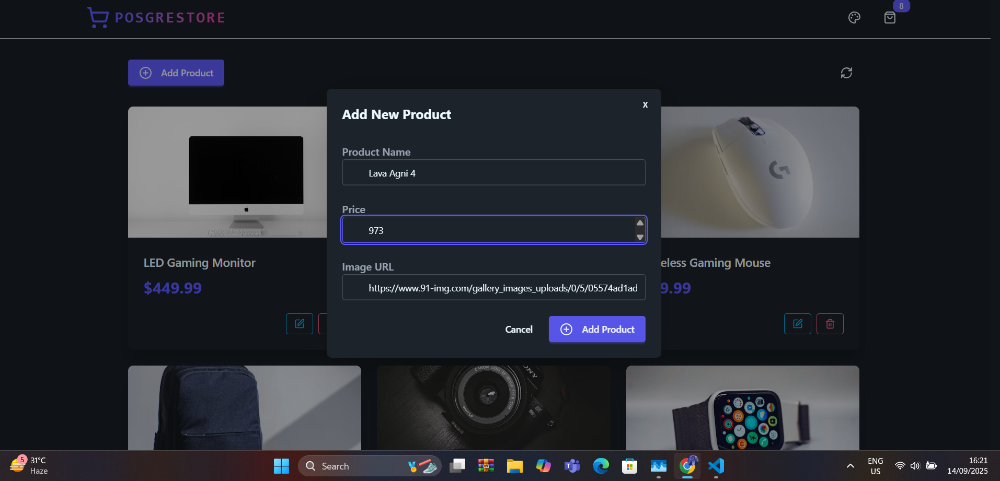
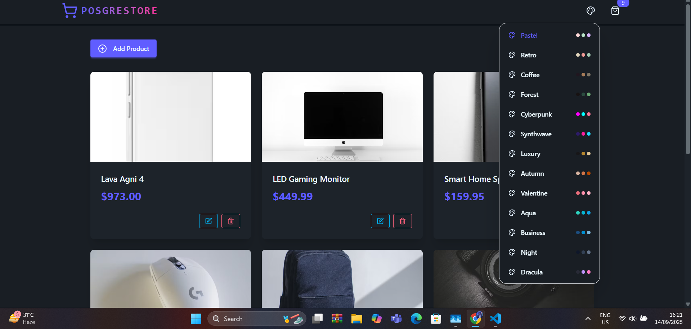
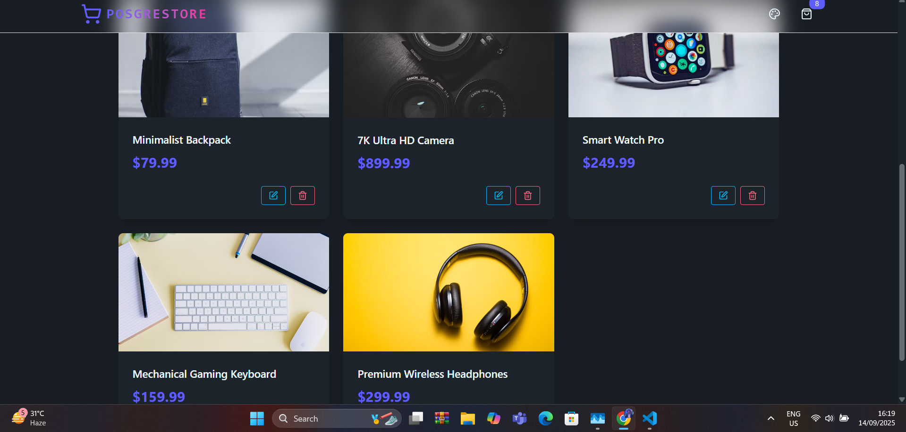
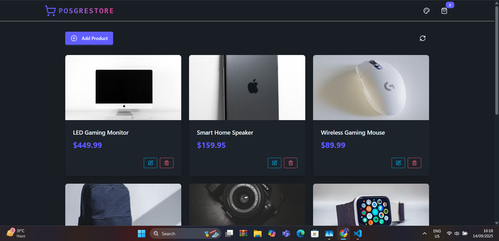
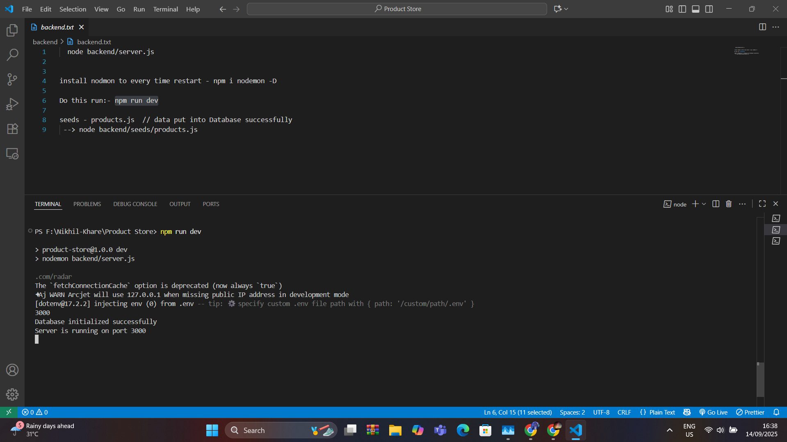

Highlights:




- 🌟 Tech stack: PERN + TailwindCSS + Daisy UI
- 🚀 Rate Limiting & Bot Detection
- 👌 Global state management with Zustand
- 🐞 Error handling both on the server and client
- ⭐ Deployment for FREE!
- ⏳ And much more!

### Setup .env file

```js
PORT=3000

PGUSER=...
PGPASSWORD=...
PGHOST=...
PGDATABASE=...

ARCJET_KEY=...
ARCJET_ENV=development
```

### Run the API

```shell
npm run dev
```


https://unsplash.com/
### Run the frontend

```shell
cd frontend
npm run dev
```







# more into 







